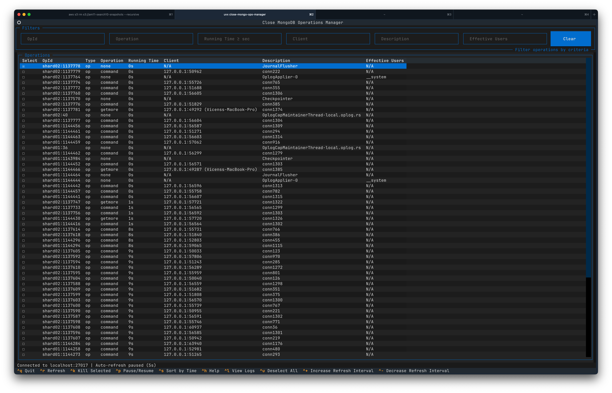

# close-mongo-ops-manager
Monitor and kill MongoDB operations

# Requirements

Install [uv](https://docs.astral.sh/uv/getting-started/installation/#installing-uv)

Once installed you should see something similar to this:
```shell
$ uv version
uv 0.5.2 (Homebrew 2024-11-14)
```

Use the right Python version
```shell
uv python install 3.12
```

List the python versions
```shell
uv python list
```

Pin the python 3.12 version
```shell
uv python pin cpython-3.12.7-macos-aarch64-none
```

# Dependencies

Sync the project
```shell
uv sync
```

# Running the app

Launch the app with the required arguments
```shell
uv run app.py --help
```


