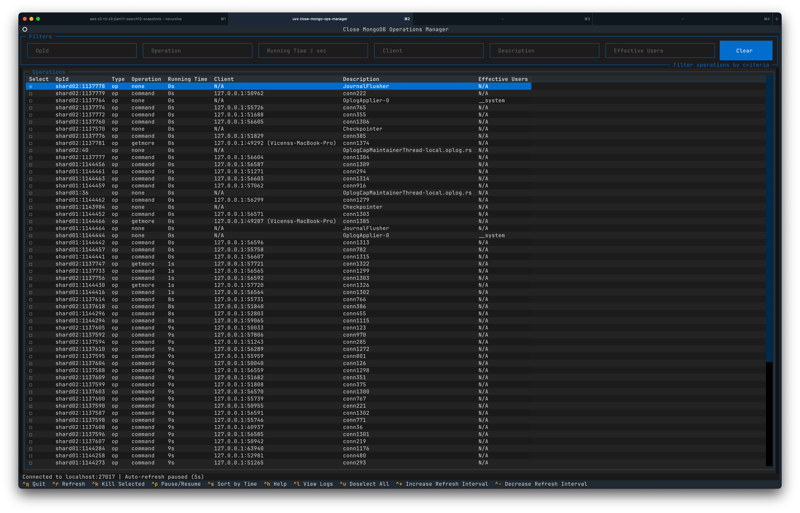

# close-mongo-ops-manager
Monitor and kill MongoDB operations (Be advised that this is in a Beta state. You may encounter some bugs.)

The app is also published in [pypi](https://pypi.org/project/close-mongo-ops-manager/)

# Requirements

Install [uv](https://docs.astral.sh/uv/getting-started/installation/#installing-uv)

Once installed you should see something similar to this:
```shell
$ uv self version
uv 0.9.5 (d5f39331a 2025-10-21)
```
# Sync Project Dependencies

Sync the project
```shell
uv sync --python 3.13
```

For development, you can use the `--all-groups` flag to install all dev dependencies
```shell
uv sync --python 3.13 --all-groups
```

### Testing

Run tests
```shell
uv run pytest -v
```

# Running the app

Launch the application
```shell
uv run src/close_mongo_ops_manager/app.py --help
```

Or you can just use `uvx`
```shell
uvx -n close-mongo-ops-manager
```

## Command Line Options

The application supports these command line options:
- `--host`: MongoDB host (default: localhost or MONGODB_HOST env var)
- `--port`: MongoDB port (default: 27017 or MONGODB_PORT env var)
- `--username`: MongoDB username (or MONGODB_USERNAME env var)
- `--password`: MongoDB password (or MONGODB_PASSWORD env var)
- `--namespace`: MongoDB namespace to monitor (default: ".*")
- `--refresh-interval`: Refresh interval in seconds (default: 2, min: 1, max: 10)
- `--show-system-ops`: Show system operations (disabled by default)
- `--load-balanced`: Enable load balancer support for MongoDB connections
- `--version`: Show version information
- `--help`: Show help information

## Usage

These are the actions you can do in the app. You can see them in the app help menu as well.
```
f1      : Show this help
Ctrl+Q  : Quit application
Ctrl+R  : Refresh operations list
Ctrl+K  : Kill selected operations
Ctrl+P  : Pause/Resume auto-refresh
Ctrl+S  : Sort by running time
Ctrl+L  : View application logs
Ctrl+A  : Toggle selection (select all/deselect all)
Ctrl+F  : Toggle filter bar visibility
Ctrl+T  : Change theme
Ctrl++  : Increase refresh interval
Ctrl+-  : Decrease refresh interval
Enter   : See operation details
Space   : Select operations
```

The mouse is enabled, so all menus are clickable.

Auto-refresh is enabled by default. If you need a stable view while deciding what to kill, pause refresh with `Ctrl+P`.

Selected operations are preserved across refreshes while the same operation IDs are still present.
There is also a known issue about in the filter bar that looses focus.

This is the tipical usage:

- Use arrow keys or mouse to navigate
- Space/Click to select operations
- Filter operations using the input fields
- Clear filters with the Clear button
- Confirm kill operations when prompted

## Theming

The application supports multiple themes that can be changed using `Ctrl+T`. Available themes include:

- **textual-dark** (default) - Standard dark theme
- **textual-light** - Standard light theme
- **close-mongodb** - Custom theme with MongoDB brand colors
- **nord** - Nord color scheme
- **gruvbox** - Gruvbox color scheme
- **tokyo-night** - Tokyo Night theme
- **solarized-light** - Solarized light theme
- **dracula** - Dracula theme
- **monokai** - Monokai theme
- **flexoki** - Flexoki theme
- **catppuccin-mocha** - Catppuccin Mocha theme
- **catppuccin-latte** - Catppuccin Latte theme

Theme preferences are automatically saved to `~/.config/close-mongo-ops-manager/config.json` and will be restored when you restart the application.

## Screenshot


